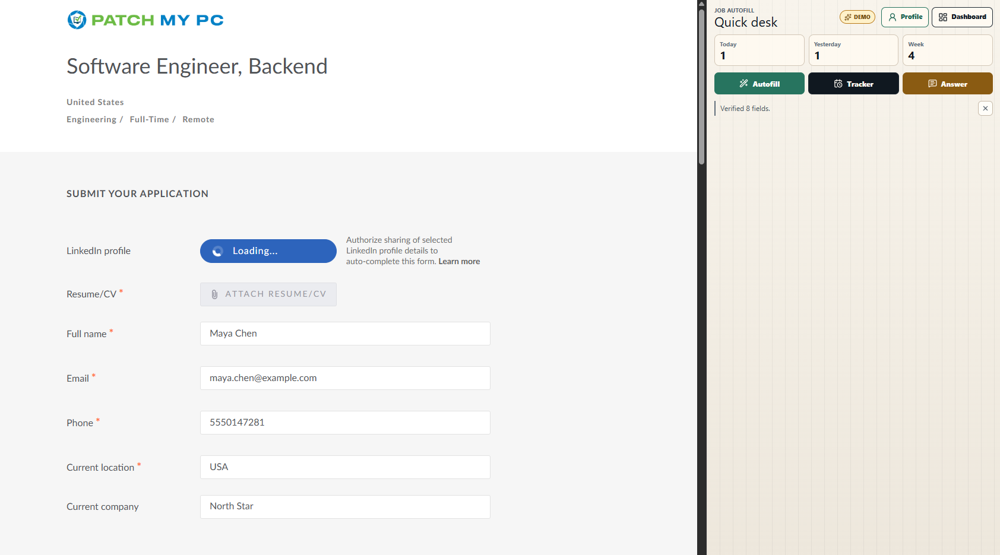
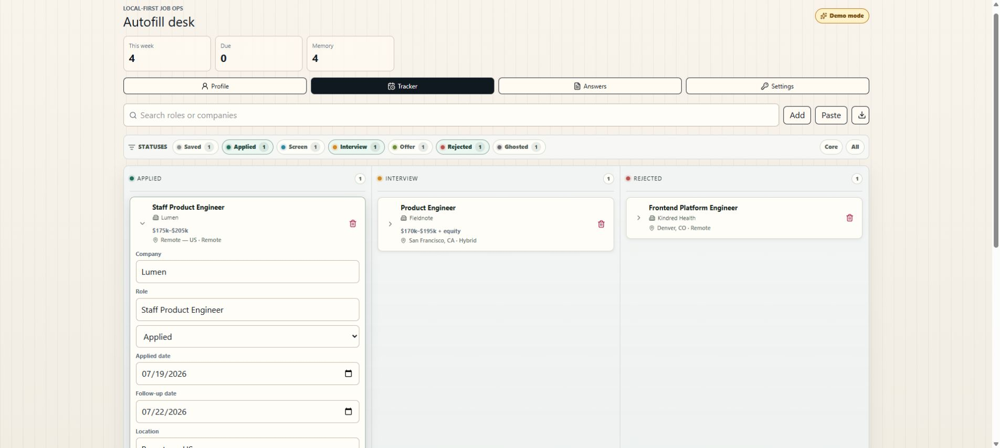

# Job Autofill + Tracker

Local-first Chrome extension for filling job applications, drafting free-text screening answers from your profile, and tracking applications.

## Screenshots

### Autofill a live application from the side panel



### Track applications and follow-up details



## Features

- WXT Manifest V3 extension skeleton with background worker, content script, quick side panel, and full dashboard page.
- Deterministic profile-based field mapping for common application fields.
- React-safe input filling via native setters and input/change/blur events.
- Greenhouse, Lever, Ashby, LinkedIn, Indeed, and Comeet host detection with explicit click-to-fill.
- Upwork proposal capture from the current page, AI parsing from pasted proposal text, manual entry, proposal economics, and conversion metrics.
- Floating post-submit prompt to confirm whether a detected application should be saved to tracking.
- Side panel tracking panel for manual tracker rows or AI parsing from pasted job postings.
- Hybrid compensation tracking with a visible compensation field plus structured currency, range, and period fields.
- Local profile/settings in `chrome.storage.local`.
- Applications and answer memory in IndexedDB via Dexie.
- Optional BYO OpenAI API key for batched AI free-text answers with an anti-fabrication prompt.
- Full dashboard profile editor, tracker kanban/table hybrid, follow-up dates, answer memory view, settings, and CSV export.
- Screenshot-safe demo mode with fictional profile, tracker, and answer data that never overwrites the real local records.

## Privacy

The extension is local-first. Profile data, settings, tracked applications, and answer memory are stored in Chrome extension storage and IndexedDB on your device.

AI features are opt-in and require your own OpenAI API key. When enabled, the extension sends the relevant profile facts, job description text, application questions, and uploaded CV file data to OpenAI to draft answers or import profile fields. The API key is stored locally in Chrome extension storage.

Tracked applications can include the questions and answers present on a submitted application form. Review exported CSV files before sharing them.

Upwork page capture reads the visible job and proposal form when you track or submit a proposal and opens a local review draft. It does not submit proposals, search, refresh, or navigate Upwork for you. Upwork may restrict unauthorized browser automation; use page capture only if it complies with your account and API permissions.

## Permissions

The extension includes built-in content-script matches for supported job sites:

- Greenhouse
- Lever
- Ashby
- LinkedIn Jobs
- Indeed
- Comeet
- Upwork

It also requests broad `http://*/*` and `https://*/*` host permissions plus the `scripting` permission so the side panel can run user-initiated autofill on the active tab, including custom ATS domains such as company-hosted job portals. The injected script checks that the page looks like a job application surface before doing work.

It requests access to `https://api.openai.com/*` for optional AI features.

## Commands

```powershell
npm install
npm run compile
npm run dev
npm run build
npm run zip
```

Load the generated development extension from `.output/chrome-mv3` in Chrome.

## Security Notes

Run `npm audit` and `npm audit --omit=dev` before publishing a release. Dependency overrides are used only for patched transitive development packages.

## License

MIT
